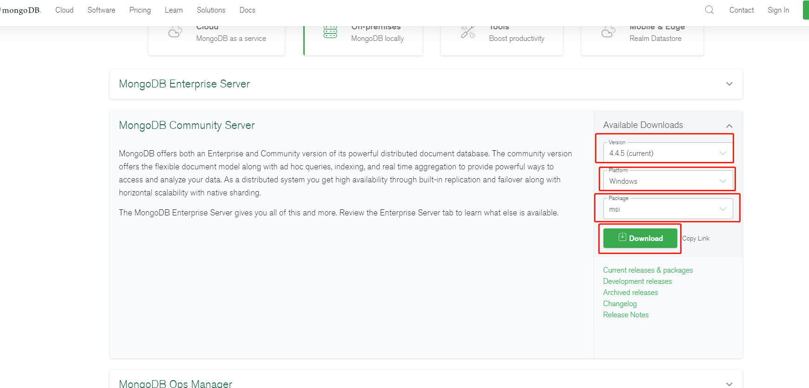

```
title: Mongodb集成使用文档
date: 2021.10.28 11:27
tags: Springboot Mongodb spring entfrm
description: springboot集成mongodb文档
```

## Mongodb集成使用文档

1.  **Mongodb下载安装
    **官网下载地址：<https://www.mongodb.com/try/download/community>
    version处选择版本，platform选择平台，package选择下载安装包或者zip解压包，点击download即可下载，如图所示
    

2.  **Mongodb，windows平台安装时可能遇到的环境问题
    **安装时，可能提示2503、2502错误终止安装，这是因为C:\\Windows\\temp没有足够的权限，如下图所示位置：
    
    需要给temp文件夹权限，右键temp文件夹点击属性，点击安全选项卡，点击User，然后点击编辑，将完全控制、修改权限 打上勾，即可解决该报错。
    
3.  **Mongodb安装步骤
    **默认选项，全点击下一步即可完成安装。会自动启动服务，默认端口27017，默认密码无。
4.  **Mongodb Compass
    **安装mongodb时选择compelte选项，会同时安装mongodb compass可视化工具，在MongoDB Compass连接数据库比较简单，可以选择默认的服务器、接口和None认证，然后点击CONNECT即可，如下图所示：
    也可以选择安装navicat for mongodb数据可视化工具, 高版本的navicat Premium也支持连接mongodb（12版本及之后版本）\
    
5.  **加入依赖**\
    在pom.xml中加入如下依赖，如下图所示：
    
6.  **修改配置文件**\
    在application.yml中加入数据库配置，如下图所示：
    
7.  **创建mongodb工厂配置**\
    如下图所示：\
    
8.  **根据配置文件，新创一个数据源类继承刚才的工厂**
    configurationProperties读取配置文件，即可开始使用，如下图所示：
    
9.  **业务代码中使用**
    如果多个数据源，需要用 \@Qualifer指定数据源，如果不指定则默认刚设置的数据源，如下图所示：
    
